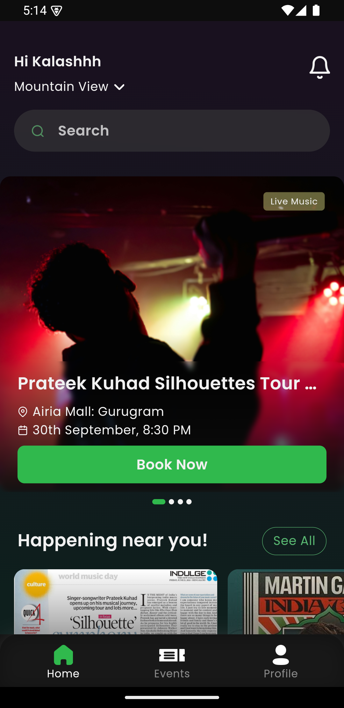

# News Shorts 📄 

An event booking app where user can buy tickets of various events.

## Features 🚀

- Get all the ebent information near you.
- Buy the event tickets.
- SHare the event with your friends.

## Screenshots 

  

  

  

  

  

  

  

  

  

  

  

## HomeScreen, WebView, Bookmarks

